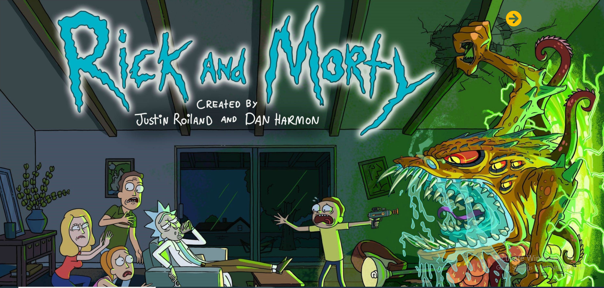

## The Rick and Morty

The Project is designed and Implemented on Rick and Morty API. The rickandmortyapi Api gives all the in depth information about the Rick and Morty series.This project was bootstrapped with XHR and API

##### API Documentation https://rickandmortyapi.com/documentation/

#### Flow of API

The Project is All about the Famous Cartoon Character
Rick And Morty.The API Consist of following three Resources

#### Character:

Used to get all the characters.

#### Episode:

Used to get all the episodes.

#### Location:

Used to get all the locations.

## Motivation

The fifth sprint project done after completing fifth month @Masai School.

## Tech/framework

[][webdevplaylist]
[][cssplaylist]
[][jsplaylist]
[][jsplaylist]

 

## Structure of Project

This Project has a Landing Page which takes us to the Home page,
Which has option search a single Character or show all characters
and can also search for Episodes.
It also has a page to look on some memes present on Rick and morty in social Media Sites.

 

## Screenshots

## Installation

> - Clone the repo
>   `git clone https://github.com/Tripathikritika/masai-sprint-5.git`

## Credits

`https://masaischool.com/`

[cssplaylist]: #
[webdevplaylist]: #
[jsplaylist]: #
